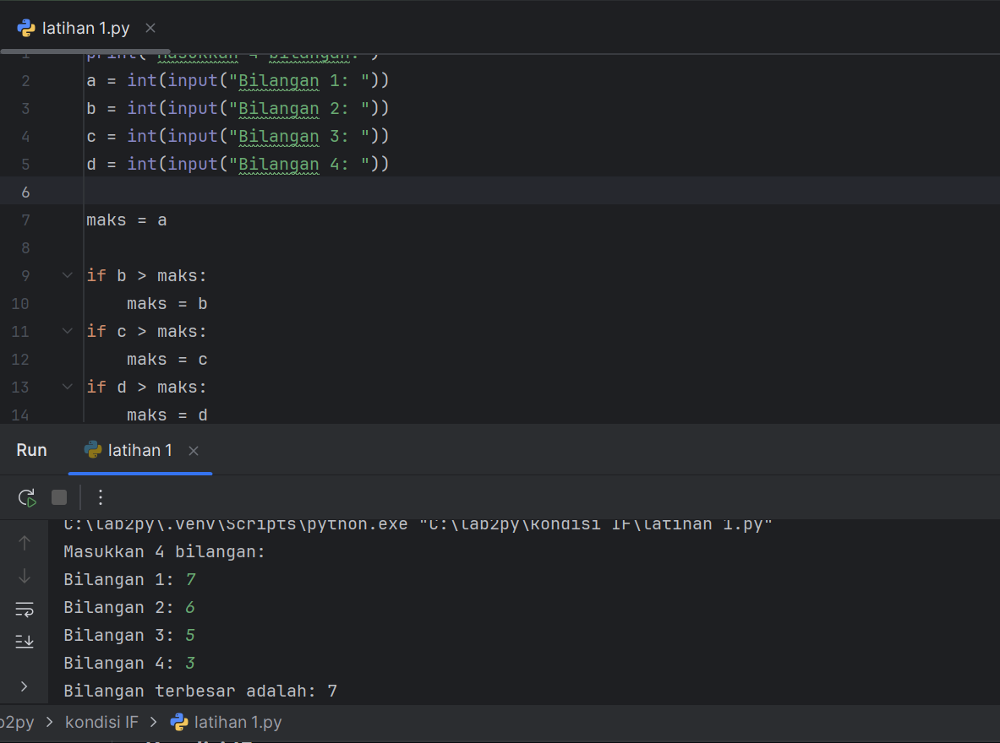
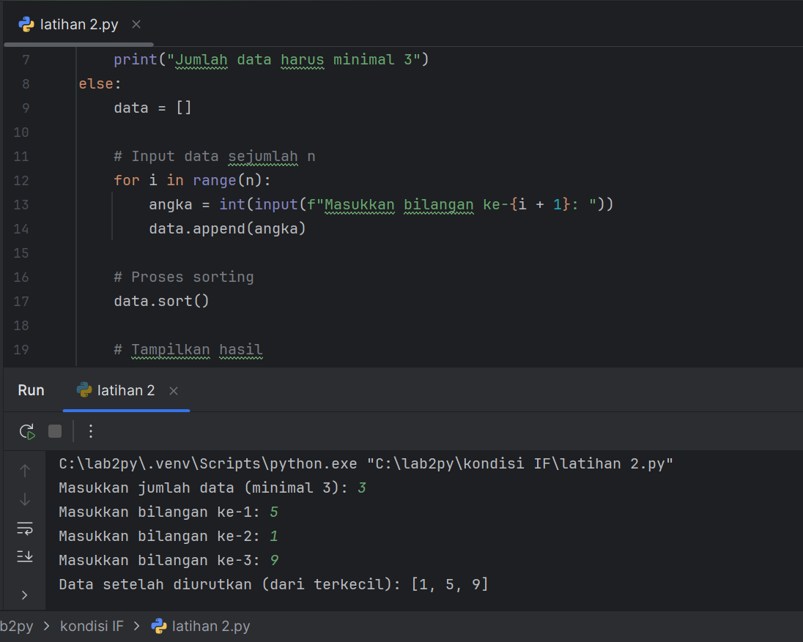
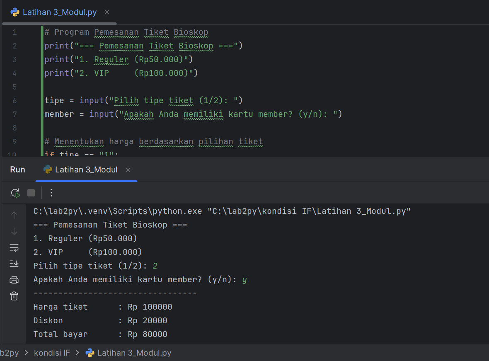
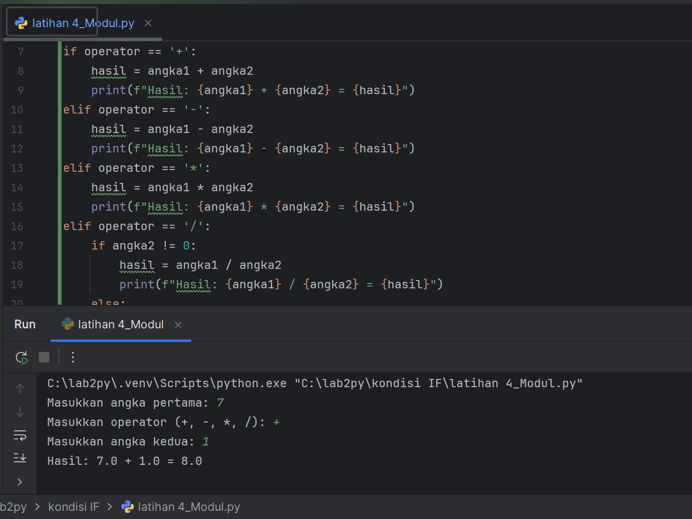
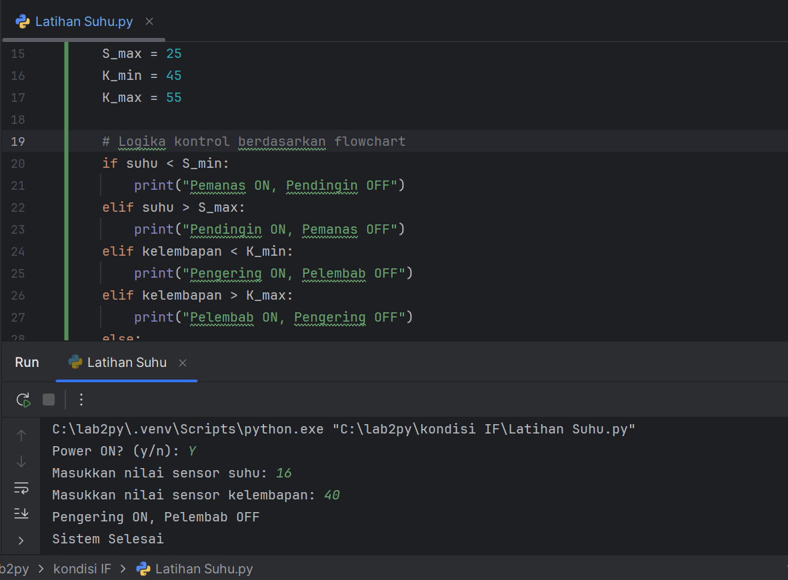
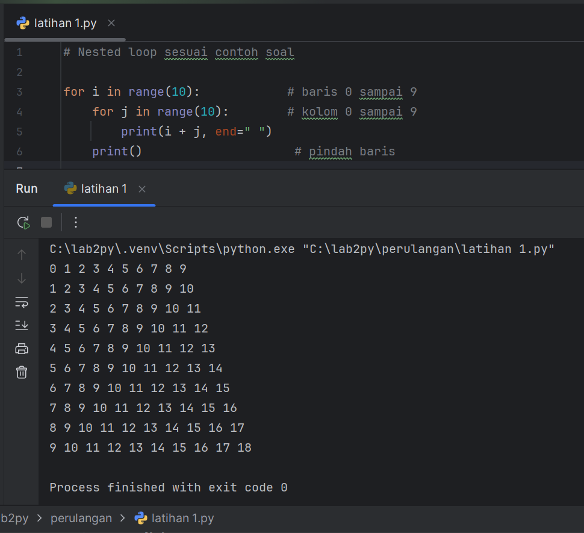
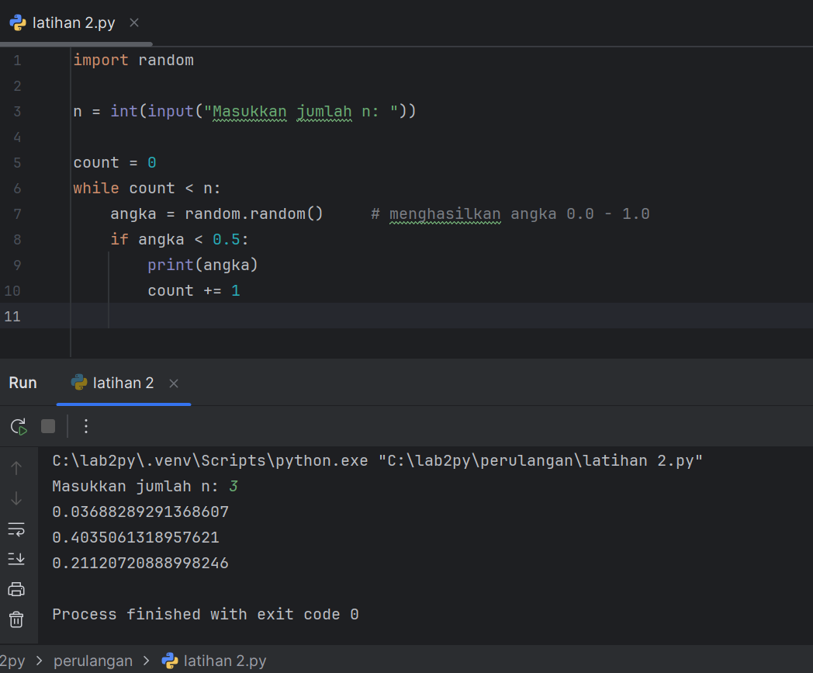

# PRAKTIKUM 2: Kondisional dan Perulangan

Praktikum ini bertujuan untuk memberikan pemahaman mengenai penerapan struktur kondisi dan perulangan untuk mengatur proses secara otomatis.

## KONDISIONAL 
### 1. Latihan 1: Menentukan bilangan terbesar dari sekumpulan bilangan menggunakan _statment if_.

**Digunakan kode pemrograman sebagai berikut:**

```python
print("Masukkan 4 bilangan:")
a = int(input("Bilangan 1: "))
b = int(input("Bilangan 2: "))
c = int(input("Bilangan 3: "))
d = int(input("Bilangan 4: "))

      maks = a

if b > maks:
    maks = b
if c > maks
    maks = c
if d > maks:
    maks = d
    
print("Bilangan terbesar adalah:", maks)
```
**Penjelasan**
  
  Dalam program ini, pengguna diminta untuk memasukkan empat bilangan dengan menggunakan fungsi `input()`, yang selanjutnya dikonversi ke tipe data integer melalui `int()`. Kemudian, variabel maks diinisialisasi dengan bilangan pertama sebagai nilai terbesar sementara. Program selanjutnya menerapkan beberapa kondisi `if` untuk membandingkan bilangan-bilangan berikutnya dengan `maks`. Jika ada bilangan yang lebih besar, maka `maks` akan diganti dengan nilai tersebut. Begitu semua pembandingan telah dilakukan, program akan menampilkan bilangan terbesar yang ditemukan dengan menggunakan `print()`. 

**Hasil latihan 1**


### 2. Latihan 2: Mengurutkan dan menampilkan data berurutan mulai dari data terkecil.

**Digunakan kode pemrograman sebagai berikut:**

```python
# Program mengurutkan data dari terkecil ke terbesar

# Meminta jumlah data (minimal 3)
n = int(input("Masukkan jumlah data (minimal 3): "))

if n < 3:
    print("Jumlah data harus minimal 3")
else:
    data = []

    # Input data sejumlah n
    for i in range(n):
        angka = int(input(f"Masukkan bilangan ke-{i + 1}: "))
        data.append(angka)

    # Proses sorting
    data.sort()

    # Tampilkan hasil
    print("Data setelah diurutkan (dari terkecil):", data)
```
**Penjelasan**

Program ini menerapkan pernyataan ``if`` untuk memverifikasi bahwa jumlah data yang diberikan pengguna setidaknya tiga, sehingga pengurutan bisa dilakukan dengan lancar. Apabila syarat itu dipenuhi, program akan memanfaatkan perulangan ``for`` untuk menerima masukan angka sebanyak yang telah ditetapkan, kemudian menyimpannya ke dalam sebuah list. Begitu seluruh data sudah terkumpul, fungsi ``sort()`` akan digunakan untuk menyusun angka dari yang terkecil hingga terbesar, dan output akhirnya akan diperlihatkan kepada pengguna.
**Hasil latihan 2**


### Latihan 3: Program Pemesanan Tiket Bioskop

**Digunakan kode pemrograman sebagai berikut:**
```python
# Program Pemesanan Tiket Bioskop
print("=== Pemesanan Tiket Bioskop ===")
print("1. Reguler (Rp50.000)")
print("2. VIP     (Rp100.000)")

tipe = input("Pilih tipe tiket (1/2): ")
member = input("Apakah Anda memiliki kartu member? (y/n): ")

# Menentukan harga berdasarkan pilihan tiket
if tipe == "1":
    harga = 50000
elif tipe == "2":
    harga = 100000
else:
    print("Pilihan tidak valid")
    exit()

# Ternary operator untuk diskon
diskon = 0.2 * harga if member.lower() == "y" else 0

total = harga - diskon

print("---------------------------------")
print("Harga tiket      : Rp", harga)
print("Diskon           : Rp", int(diskon))
print("Total bayar      : Rp", int(total))
```

**Penjelasan**

Program ini menyediakan opsi jenis tiket kepada pengguna, yang kemudian diminta untuk memasukkan jenis tiket dan status keanggotaannya. Di dalam blok ``if``, sistem mengecek apakah pengguna memilih tiket reguler dan menetapkan harganya sebesar Rp50.000. Pada blok ``elif``, jika pengguna memilih tiket VIP, harga ditetapkan menjadi Rp100.000. Di blok ``else``, program akan dihentikan jika input yang diberikan tidak sah. Setelah harga ditetapkan, operator ternary diterapkan untuk memberikan potongan harga 20% apabila pengguna memiliki kartu anggota. Akhirnya, program menghitung jumlah pembayaran akhir dan menampilkannya pada layar.
**Hasil latihan 3**


### Latihan 4: Program Kalkulator Sederhana

**Digunakan kode pemrograman sebagai berikut:**
```python
# Program Kalkulator Sederhana
angka1 = float(input("Masukkan angka pertama: "))
operator = input("Masukkan operator (+, -, *, /): ")
angka2 = float(input("Masukkan angka kedua: "))

# Menggunakan if-elif-else untuk menentukan operasi
if operator == '+':
    hasil = angka1 + angka2
    print(f"Hasil: {angka1} + {angka2} = {hasil}")
elif operator == '-':
    hasil = angka1 - angka2
    print(f"Hasil: {angka1} - {angka2} = {hasil}")
elif operator == '*':
    hasil = angka1 * angka2
    print(f"Hasil: {angka1} * {angka2} = {hasil}")
elif operator == '/':
    if angka2 != 0:
        hasil = angka1 / angka2
        print(f"Hasil: {angka1} / {angka2} = {hasil}")
    else:
        print("Error: Pembagian dengan nol tidak diperbolehkan.")
else:
    print("Operator tidak valid. Gunakan +, -, *, atau /.")
```

**Penjelasan**

Program ini meminta pengguna untuk memasukkan dua angka dan satu operator. Di dalam blok ``if``, program akan melaksanakan operasi penjumlahan jika operator yang dipilih adalah “+”. Pada blok ``elif`` berikutnya, program akan melakukan pengurangan, perkalian, atau pembagian sesuai dengan operator yang diberikan. Untuk operasi pembagian, terdapat pemeriksaan tambahan untuk memastikan bahwa angka kedua tidak sama dengan nol. Apabila operator yang dimasukkan tidak valid, blok ``else`` akan menampilkan pesan kesalahan. Terakhir, hasil dari operasi tersebut akan ditampilkan di layar.
**Hasil latihan 4**


### Latihan Suhu

**Digunakan kode pemrograman sebagai berikut:**
```python
# Program Kontrol Suhu dan Kelembapan

# Deklarasi dan inisialisasi variabel
power = input("Power ON? (y/n): ")

if power.lower() != "y":
    print("Alat Mati")
else:
    # Baca sensor
    suhu = float(input("Masukkan nilai sensor suhu: "))
    kelembapan = float(input("Masukkan nilai sensor kelembapan: "))

    # Batasan suhu dan kelembapan
    S_min = 15
    S_max = 25
    K_min = 45
    K_max = 55

    # Logika kontrol berdasarkan flowchart
    if suhu < S_min:
        print("Pemanas ON, Pendingin OFF")
    elif suhu > S_max:
        print("Pendingin ON, Pemanas OFF")
    elif kelembapan < K_min:
        print("Pengering ON, Pelembab OFF")
    elif kelembapan > K_max:
        print("Pelembab ON, Pengering OFF")
    else:
        print("Semua alat OFF")

    print("Sistem Selesai")
```

**Penjelasan**

Program ini memeriksa apakah daya listrik dalam keadaan aktif. Jika tidak, blok ``if`` segera mematikan perangkat. Apabila daya menyala, program akan mengukur suhu dan kelembapan, lalu membandingkannya dengan batas yang telah ditentukan. Dalam bagian ``if`` dan ``elif``, perangkat dioperasikan sesuai dengan situasi, contohnya menghidupkan pemanas saat suhu terlalu rendah atau pendingin saat suhu terlalu tinggi. Jika semua parameter berada dalam kondisi normal, bagian else memastikan semua perangkat tetap dalam keadaan mati. Setelah itu, program menampilkan bahwa sistem telah menyelesaikan tugasnya.
**Hasil latihan Suhu**


## PENGULANGAN
### Latihan 1: Membuat program perulangan bertingkat

**Digunakan kode pemrograman sebagai berikut:**
```python
# Nested loop sesuai contoh soal

for i in range(10):            # baris 0 sampai 9
    for j in range(10):        # kolom 0 sampai 9
        print(i + j, end=" ")
    print()                     # pindah baris
```
**Penjelasan**
Program ini memanfaatkan loop ``for`` i untuk mengatur baris, dan loop for j untuk menampilkan angka di setiap kolom. Setiap angka yang dihasilkan merupakan hasil penjumlahan antara ``i+j``. Dengan menambahkan ``end=" "``, angka-angka dalam loop for j akan tetap tercetak dalam satu baris yang sama, sementara ``print()`` di akhir berfungsi untuk berpindah ke baris baru.
**Hasil latihan 1 Pengulangan**


### Latihan 2: Menampilkan bilangan acak < 0.5

**Digunakan kode pemrograman sebagai berikut:**
```python
import random

n = int(input("Masukkan jumlah n: "))

count = 0
while count < n:
    angka = random.random()     # menghasilkan angka 0.0 - 1.0
    if angka < 0.5:
        print(angka)
        count += 1
```

**Penjelasan**

Program ini memanfaatkan import random untuk menghasilkan angka acak. Pengguna memasukkan jumlah bilangan yang ingin ditampilkan, kemudian ``while count`` < n digunakan agar proses tetap berjalan hingga jumlah bilangan yang diinginkan terpenuhi. Di dalam while, program mengambil angka acak dari ``random.random()``. Pada bagian ``if``, angka hanya akan dicetak jika nilainya kurang dari 0.5. Setiap angka yang valid yang ditampilkan akan menambah nilai count, sehingga loop akan berhenti setelah jumlah yang diminta tercapai.
**Hasil latihan 2 Pengulangan**

